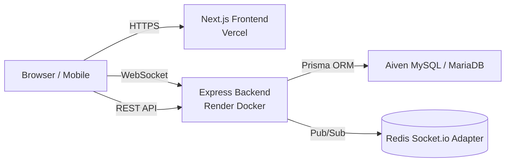

# TaskScale — Real-Time Collaborative Kanban Board

<div align="center">

[](https://taskscale.site)
[](https://task-scale-backend.onrender.com/api/docs)
[](https://github.com/Rauf74/task-management-app)

[](https://nextjs.org/)
[](https://www.typescriptlang.org/)
[](https://tailwindcss.com/)
[](https://expressjs.com/)
[](https://www.prisma.io/)
[](https://socket.io/)
[](https://mariadb.org/)

</div>

**TaskScale** is a production-ready, real-time collaborative Kanban task management platform. It demonstrates end-to-end full-stack engineering: a responsive Next.js 16 dashboard with drag-and-drop boards, an Express.js REST API with Prisma ORM, and WebSocket-powered live collaboration across distributed clients.

Built to solve the "where is my task now?" problem for small teams, it features multi-workspace organization, instant card movement synchronization, dark/light themes, audit-grade activity logs, and secure cross-domain authentication.

---

## 🌐 Live Production

| Component | URL | Platform |
|-----------|-----|----------|
| Web Application | [https://taskscale.site](https://taskscale.site) | Vercel |
| API & OpenAPI Docs | [https://task-scale-backend.onrender.com/api/docs](https://task-scale-backend.onrender.com/api/docs) | Render (Docker) |
| Health Check | [https://task-scale-backend.onrender.com/api/health](https://task-scale-backend.onrender.com/api/health) | — |

---

## ✨ Key Features

- **Kanban Boards & Drag-and-Drop** — Move tasks across columns with `@dnd-kit`, supporting both desktop pointer and mobile touch interactions.
- **Real-Time Collaboration** — Socket.io broadcasts card moves, edits, and column changes instantly to all connected clients.
- **Multi-Workspace Organization** — Users can create workspaces, boards, columns, and tasks with clean ownership isolation.
- **Label Management** — Color-coded labels (Bug, Feature, etc.) for quick task categorization.
- **Global Activity Feed** — Centralized activity history shown on the dashboard and in the navigation menu.
- **Dark & Light Mode** — Theme-aware UI built with Tailwind CSS v4 and `next-themes`.
- **Secure Authentication** — JWT stored in `HttpOnly`, `Secure`, `SameSite=None` cookies to mitigate XSS and enable cross-domain auth.
- **Interactive API Documentation** — Swagger UI auto-generated from JSDoc annotations.
- **Rate Limiting & Security Headers** — Helmet.js and Express rate limiter (300 req / 15 min).
- **E2E Testing** — Playwright test suite configured for critical user flows.

---

## 🛠️ Tech Stack

### Frontend
| Technology | Purpose |
|------------|---------|
| Next.js 16 (App Router) | Server/Client hybrid rendering, modern React framework |
| TypeScript | Static type safety |
| Tailwind CSS v4 | Utility-first responsive styling |
| shadcn/ui + Radix UI | Accessible, composable UI primitives |
| @dnd-kit | Pointer and touch drag-and-drop |
| Socket.io Client | Real-time event synchronization |
| next-themes | Dark/light theme management |
| Recharts | Analytics visualization |
| Zod + React Hook Form | Schema validation and form handling |
| Playwright | End-to-end testing |

### Backend
| Technology | Purpose |
|------------|---------|
| Express.js 5 | REST API server |
| TypeScript | Type-safe backend logic |
| Prisma 7 ORM | Type-safe database access |
| MariaDB / MySQL | Relational data store |
| Socket.io + Redis Adapter | WebSocket pub/sub across instances |
| JWT (jsonwebtoken) | Stateless authentication |
| Zod | Request body validation |
| Helmet.js | HTTP security headers |
| express-rate-limit | Brute-force protection |
| Swagger JSDoc | OpenAPI documentation |

### DevOps & Infrastructure
| Technology | Purpose |
|------------|---------|
| Vercel | Frontend deployment with HTTPS & custom domain |
| Render | Docker-based backend deployment |
| Aiven MySQL | Managed cloud database |
| Docker & Docker Compose | Local multi-container environment |
| Nginx | Local reverse proxy |

---

## 🏗️ Architecture

TaskScale follows a **split-deployment architecture** with clean separation between the Next.js frontend, Express backend, and the relational database. Backend logic is organized into Controllers → Services → Repositories for testability and maintainability.



### Backend Clean Architecture
```
backend/src/
├── controllers/      # HTTP request/response handlers
├── services/         # Business logic
├── repositories/     # Database query isolation
├── routes/           # Endpoint mapping
├── middleware/       # Auth, validation, error handling
├── socket/           # WebSocket event handlers
├── lib/              # Prisma client, Swagger config
└── types/            # Shared TypeScript definitions
```

---

## 📁 Project Structure

```text
task-management/
├── frontend/                 # Next.js 16 application
│   ├── src/app/              # App Router: auth & dashboard groups
│   ├── src/components/       # UI, board, and dashboard components
│   ├── src/lib/              # API client, auth context, socket provider
│   ├── playwright.config.ts  # E2E test configuration
│   └── Dockerfile
├── backend/                  # Express.js 5 API
│   ├── src/controllers/
│   ├── src/services/
│   ├── src/repositories/
│   ├── src/routes/
│   ├── src/middleware/
│   ├── src/socket/
│   ├── prisma/schema.prisma  # Database schema
│   └── Dockerfile
├── docker-compose.yml        # Local multi-service orchestration
├── nginx.local.conf          # Local reverse proxy
└── README.md
```

---

## 🚀 Getting Started

### Prerequisites
- Node.js ≥ 20
- MySQL / MariaDB server running locally
- Redis (optional; backend falls back to in-memory adapter)

### 1. Clone the repository
```bash
git clone https://github.com/Rauf74/task-management-app.git
cd task-management-app
```

### 2. Backend setup
```bash
cd backend
cp .env.example .env
# Edit .env and set your DATABASE_URL
npm install
npx prisma generate
npx prisma db push
npm run dev
```
Backend will run at `http://localhost:4000` by default.

### 3. Frontend setup
```bash
cd ../frontend
cp .env.example .env
# Ensure NEXT_PUBLIC_API_URL=http://localhost:4000
npm install
npm run dev
```
Open [http://localhost:3000](http://localhost:3000) in your browser.

### 4. Run with Docker Compose (optional)
```bash
# From the project root
cp .env.example .env
# Fill DATABASE_URL, JWT_SECRET, REDIS_URL, etc.
docker-compose up --build
```
Access the app at [http://localhost:8080](http://localhost:8080).

---

## 🧪 Testing

### End-to-End (Playwright)
```bash
cd frontend
npm run e2e          # Headless
npm run e2e:ui       # Interactive UI mode
npm run e2e:report   # View report
```

---

## 🌍 Deployment

### Production checklist
1. **Database**: Create a MySQL/MariaDB service (e.g., Aiven). Disable `sql_require_primary_key` if using Aiven.
2. **Backend**: Deploy `backend/` folder to Render as a Docker Web Service (port `4000`).
   - Required env vars: `DATABASE_URL`, `JWT_SECRET`, `JWT_EXPIRES_IN`, `FRONTEND_URL`, `PORT`.
3. **Frontend**: Deploy `frontend/` folder to Vercel as a Next.js app.
   - Required env var: `NEXT_PUBLIC_API_URL` pointing to your Render backend.
4. **CORS & Cookies**: Ensure `FRONTEND_URL` has no trailing slash and cookie `SameSite=None; Secure` is enabled for production.

For detailed production steps and troubleshooting, see [`DEPLOY.md`](./DEPLOY.md).

---

## 🔒 Security Highlights

- **HttpOnly JWT cookies** prevent JavaScript access to tokens.
- **Helmet.js** secures HTTP headers, with CSP relaxed only for Swagger UI.
- **Zod validation** on all request bodies to reject malformed input.
- **Rate limiting** protects authentication endpoints from brute force.
- **RBAC-ready structure** isolates workspace and board ownership in repositories.

---

## 📈 Future Roadmap

- Board/Workspace edit & delete dialogs
- Bulk selection and batch actions
- Global search (Ctrl+K) and board filters
- Task due-date reminders and browser notifications
- Data export (JSON/CSV)

See [`frontend/IMPROVEMENT_PLAN.md`](./frontend/IMPROVEMENT_PLAN.md) for the full improvement plan.

---

## 🙋‍♂️ Author

**Abdur Rauf Al Farras**
- GitHub: [@Rauf74](https://github.com/Rauf74)
- LinkedIn: *(add your profile link)*

---

*Built as a portfolio project to demonstrate modern full-stack engineering, real-time systems, and production deployment workflows.*
